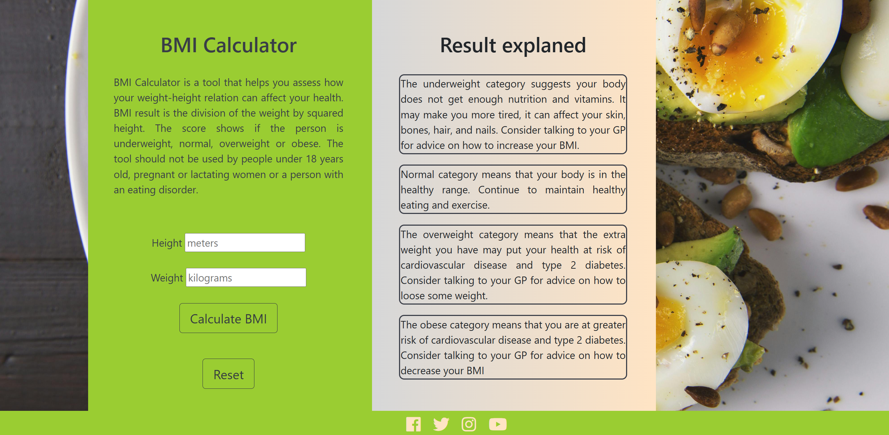
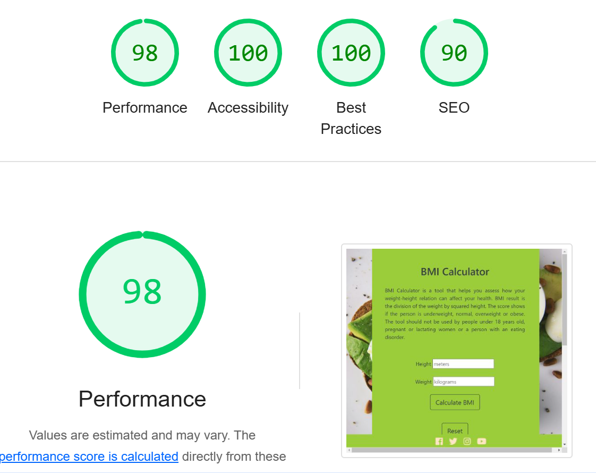

<h1 align="center">BMI Calculator</h1>

[View the live project here.](https://krasi5.github.io/Milestone2/)

BMI Calculator site is created as a Milestone Project 2 for a Web Development course. It is designed to be responsive and accessible on a range of devices, making it easy to navigate for potential users.

<h2 text-align="center"></h2>

## User Experience (UX)

 ### User stories
       
  -   #### First Time Visitors Goals
  
      1. As a First Time Visitor, I want to easily understand the main purpose of the site and learn more about the company.
      2. As a First Time Visitor, I want to be able to easily navigate through the site and find information about the service they provide.
      3. As a First Time Visitor, I want to locate their social media links to find information on social media about the company's followers to determine how known and trusted they are.
 

  -   #### Returning Visitors Goals
      1. As a Returning Visitor, I want to find information about services offered.
      2. As a Returning Visitor, I want to navigate quickly through the site and familiarise myself with the options offered.
      3. As a Returning Visitor, I want to find an advise for what to do next. 
  
  -   #### Frequent User Goals
      1. As a Frequent User, I want to be able to access the site from different devices and find easily the information I need.
      2. As a Frequent User, I want to be able to use the calculator quick and easy.
      
  
 ### Design

 -  #### Colour Scheme
  -   The website main colors are lightgreen and bisque
 -  #### Typography
  -   The Noto Serif from [Google Fonts](https://fonts.google.com/) is the main font used throughout the whole website with Sans Serif as the fallback font in case for any reason the font isn't being imported into the site correctly. Noto is a global font collection for writing in all modern and ancient languages. The font is attractive and appropriate. 
 -  #### Imagery
   - The background hero image is chosen to convey the main purpose of the website and to attract the potential user's attention.

 ### Wireframes

 ## Features
  - Responsive on all devices
  - Link to social media accounts
 
  BMI Calculator website, created as a Milestone Project 2 for a Web Development course. Its purpose is to be a tool for finding the ratio weight-height.
## Technologies Used

### Languages Used 
-   [HTML5](https://en.wikipedia.org/wiki/HTML5)
-   [CSS3](https://en.wikipedia.org/wiki/CSS)

### Frameworks, Libraries & Programs Used
1. [Bootstrap 4.1.3:](https://getbootstrap.com/docs/4.1/getting-started/introduction/)
 - Bootstrap was used to assist with the styling and responsiviness of the website.
 2. [Google Fonts](https://fonts.google.com/)
 - Google fonts were used to import the 'Noto Serif' font into the GYmPlus.html file which was used on all pages throught the project.
 3. [Font Awesome](https://fontawesome.com/)
 - Font Awesome was used to add icons of social media for aesthetic and UX purposes.
 4. [Gitpod](https://gitpod.io/) 
  Gitpod terminal was used to commit and push to GitHub.
 5. [W3schools](https://www.w3schools.com/) 
 W3schools was used to assist with styling of the website.
 6. [jsvalidator](https://jsvalidator.com/)
## Testing
 - The W3C Markup Validator and W3C CSS Validator Services were used to validate all the pages in the project to ensure no syntax errors exist.
 - To test javascript code was used jsvalidator.

### Testing User Stories from User Experience (UX) Section

### Further Testing
-  The website was tested on Google Chrome and Microsoft Edge browsers.
-  The Website was tested on Google Lighthouse:
-  
-  The website was viewed on a variety of devices such as Desktop, Macbook, iPhone 12 Pro, Samsung Galaxy S8, NestHub Max, Asus Zenbook Fold.
- Automated testing 
### Known Bugs

## Credits

### Code
The hero image was taken from [pexels website](https://www.pexels.com/)
A help ith a code was seeked from [youtube] (https://www.youtube.com/) tutorials, 
[ChatGPT] (https://chatgpt.com/),
[Code Institute](https://learn.codeinstitute.net/ci_program/level5diplomainwebappdevelopment) learning videos

### Acknowledgements

-  My Mentor Excellence Ilesanmi for continuous helpful feedback.

-  My Tutor Rachel Furlong for her empowering support.
