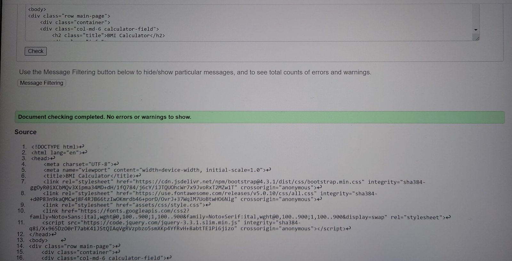

<h1 align="center">BMI Calculator</h1>

[View the live project here.](https://krasi5.github.io/Milestone2/)

<h2 text-align="center"></h2>

BMI Calculator site is created as a Milestone Project 2 for a Web Development course. It is designed to be responsive and accessible on a range of devices, and easy to navigate for potential users.

## User Experience (UX)
 
 ### User stories
       
   #### Users Goals
  
      1. As a First Time Visitor, I want to easily understand the main purpose of the site.
      2. As a user, I want to find calculator to use for calculation of BMI.
      3. As a user, I want to know clearly what category is my BMI.
      4. As a user, I want to know what can I do for my health following the result.
      5. As a user, I want to be able to access the site from different devices.
      6. As a user, I want to be able to use the calculator quick and easy.
      7. As a user, I want to ask question and get answer.
      8. As a Returning Visitor, I want to find an advise for what can I do according to results. 
      
  
 ### Design

   #### Colour Scheme
   
  -   The website's main colors are yellow-green and bisque with a linear gradient to grayish-blue.
 
   #### Typography
   
   - The Noto Serif from [Google Fonts](https://fonts.google.com/) is the main font used throughout the whole website with Sans Serif as the fallback font in case for any reason the font isn't being imported into the site correctly. Noto is a global font collection for writing in all modern and ancient languages. The font is attractive and appropriate. 

    #### Imagery
    
   - The background hero image is chosen to convey the connection between BMI and food, and to attract the potential user's attention.

 ### Wireframes

  -  Home Page Wireframe -

  

  -  Mobile Page Wireframe -

      
 

BMI Calculator website, created as a Milestone Project 2 for a Web Development course. Its purpose is to be a tool for finding the weight-height ratio in order to assess person's health.

      

## Features

  - Responsive on all devices
    
  - Links to social media accounts

    
  
  - Calculator for BMI calculation

    
       
  - Reset button

    

  - Copyright

    

  - Result box color scheme

    

  - Contact feature

    

  - Message box

    

## Technologies Used

 ### Languages Used 
 
-   [HTML5](https://en.wikipedia.org/wiki/HTML5)
-   [CSS3](https://en.wikipedia.org/wiki/CSS)
-   [Javascript](https://en.wikipedia.org/wiki/JavaScript)

 ### Frameworks, Libraries & Programs Used
 
1. [Bootstrap 4.1.3:](https://getbootstrap.com/docs/4.1/getting-started/introduction/)
 - Bootstrap was used to assist with the styling and responsiviness of the website.
 2. [Google Fonts](https://fonts.google.com/)
 - Google fonts were used to import the 'Noto Serif' font into the index.html file which was used in the project.
 3. [Font Awesome](https://fontawesome.com/)
 - Font Awesome was used to add icons of social media for aesthetic and UX purposes.
 4. [Gitpod](https://gitpod.io/) 
  Gitpod terminal was used to commit and push to GitHub.
 5. [W3schools](https://www.w3schools.com/) 
 W3schools was used to assist with styling of the website.
 6. [jsvalidator](https://jsvalidator.com/)
 7. [Balsamiq](https://balsamiq.com/) used for wireframes.
 8. [Codebeautify](https://codebeautify.org/) used for css validation 

## Testing

 - The W3C Markup Validator and W3C CSS Validator Services were used to validate all the pages in the project to ensure no syntax errors exist.
 - To test javascript code was used jsvalidator.
 - W3C Markup Validator

   
  
  - W3C CSS Validator
 
   

  - CSS file was put in order as Codebeautify advised.
 
 - Codebeautify validator

    
    
 - JSvalidator
 
    

 ### Testing User Stories from User Experience (UX) Section

- As a First Time Visitor, I want to easily understand the main purpose of the site.
  
  The BMI Calculator website's purpose is to be a tool for finding the weight-height ratio and guiding the users for the measures of what they can do to be
  within the normal category BMI. On the left box, there is an information of what BMI Calculator is and how BMI is calculated. On the right side box, there are
  four boxes informing for the different categories of BMI.

  

  - As a user, I want to use calculator to find out what my BMI is.

   The calculator is situated right under the information.

   

  - As a user, I want to know clearly what category is my BMI.
   
   

 -As a user I want to get more information and be able to address my query

 
  

 ### Manual Testing
 
-  The website was tested on Google Chrome and Microsoft Edge, and Safari browsers.
-  The Website was tested on Google Lighthouse:
  
  

- After adding more features the site was tested again:

  

- The SEO was improved by adding meta discription

  

-  The website was viewed on a variety of devices such as Desktop, Macbook, iPhone 12 Pro, Samsung Galaxy S8, NestHub Max, Asus Zenbook Fold.

  

 ### Automated testing

 
- Automated testing is a code used to test the code. It has many advantages over manual testing: hundreds of tests can be done quickly, automated tests are written specifically for the developed project and pick up the mistakes early, can be written for specific case. However, they do not test user experience and are as good as the questions we ask.
- I have decided to use manual testing due to the small scope of the project. 

 ### Deployment

The project was deployed to Github.com using Code institute workspace - gitpod.io, on later stage Visual Studio Code.
Due to the belief that I have to deploy only working files, the JavaScript file was developed and tested offline and deployed at once. Later on copyright was added and an Enter key event.

## Credits

 ### Code
 
- The code was written by the developer, help was seeked from internet when needed.
- The hero image was taken from [pexels website](https://www.pexels.com/).
- [stackoverflow.com](https://stackoverflow.com/)-help with page reset.
- [youtube] (https://www.youtube.com/) tutorials, which was used in style.css- (https://www.youtube.com/watch?v=hWGgw1K-i8Y) and copyright feature.
- [ChatGPT] (https://chatgpt.com/)- help with result appearance.
- [Code Institute](https://learn.codeinstitute.net/ci_program/level5diplomainwebappdevelopment) learning videos.

 ### Acknowledgements

-  My Mentor Excellence Ilesanmi for continuous helpful feedback.
-  My Tutor Rachel Furlong for her empowering support.
